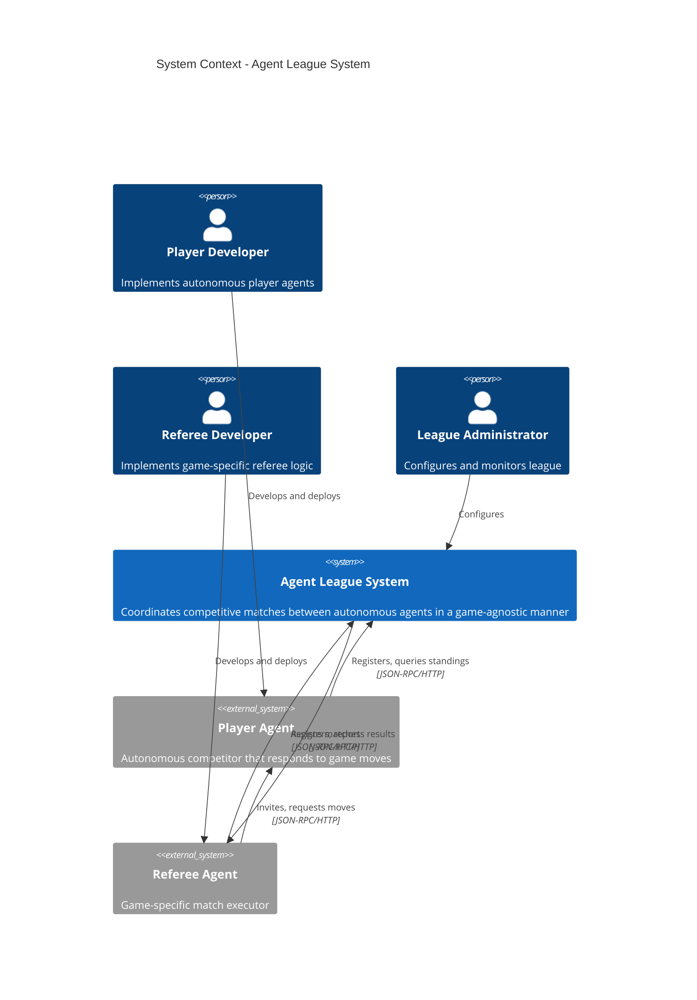
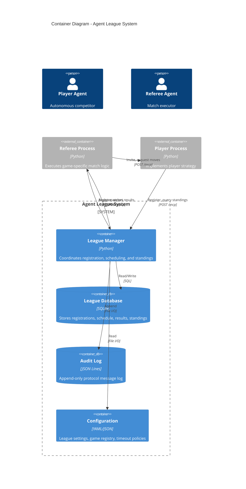
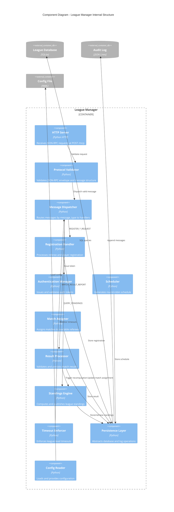
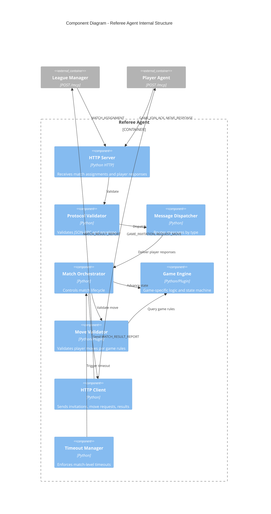
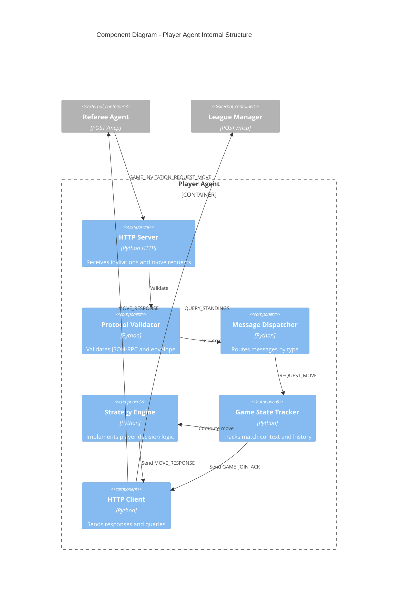
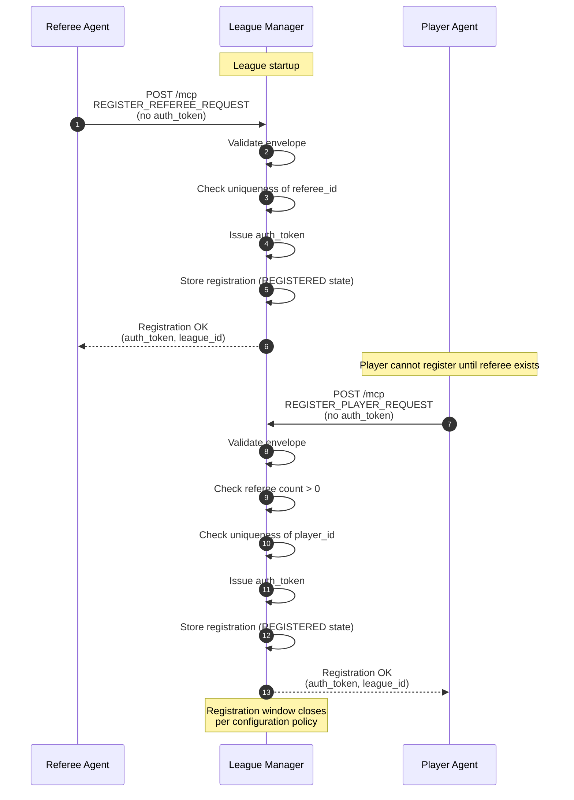
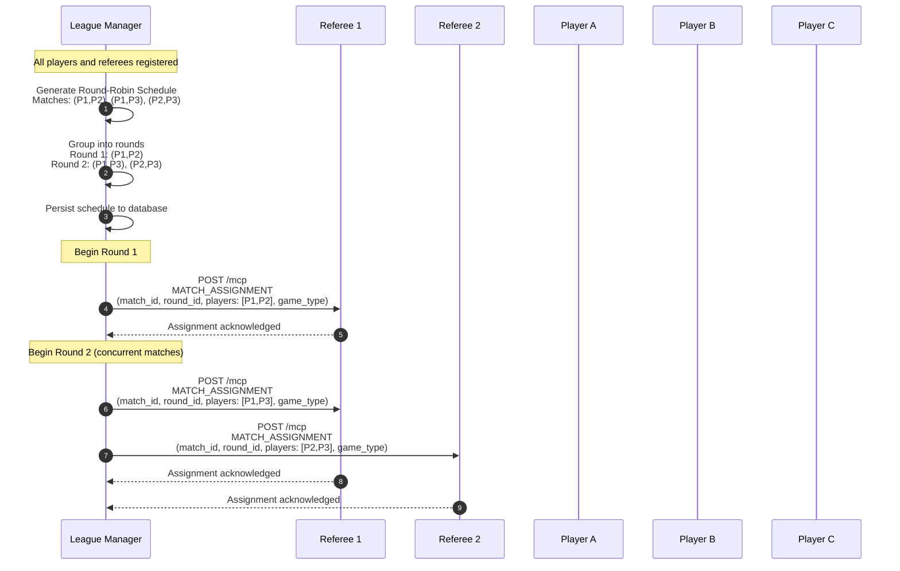
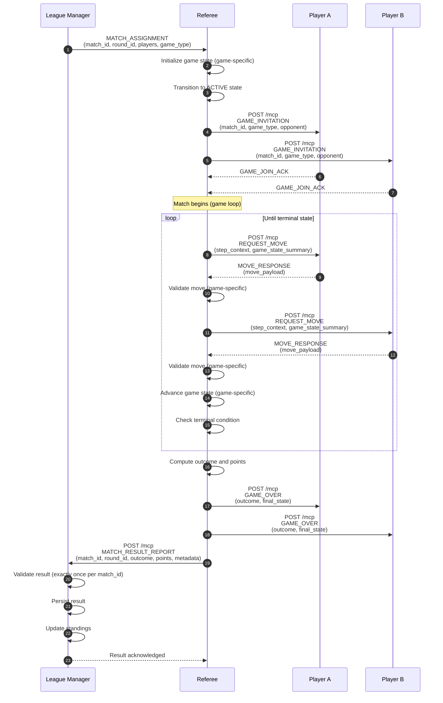
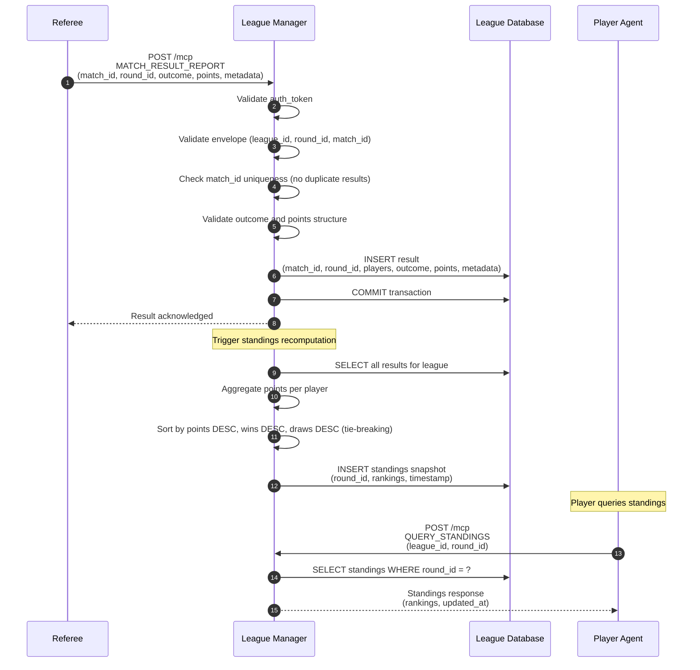
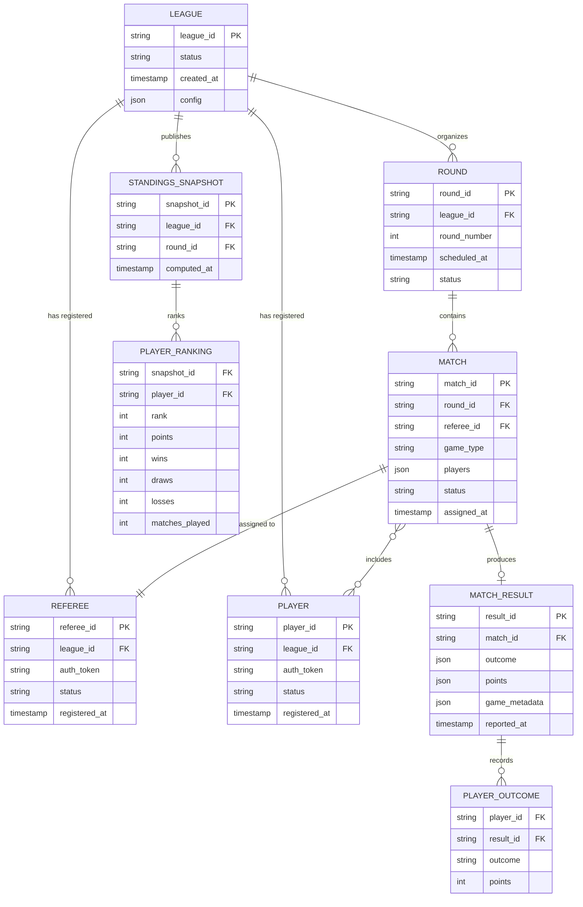

# Architecture Documentation - Agent League System

## Document Control
- **Version**: 1.0
- **Last Updated**: 2025-01-21
- **Status**: Authoritative
- **Related Documents**:
  - [PRD](PRD.md)
  - [ADR-001: JSON-RPC Transport](ADRs/001-json-rpc-transport.md)
  - [ADR-002: Round-Robin Scheduling](ADRs/002-round-robin-scheduling.md)
  - [ADR-003: Game-Agnostic Referee Pattern](ADRs/003-game-agnostic-referee.md)

---

## 1. Executive Summary

The Agent League System is a game-agnostic league coordinator for autonomous agents. It orchestrates competitive matches between player agents using a hub-and-spoke communication model, where referees execute game logic and a central League Manager handles registration, scheduling, and standings computation.

### Key Architectural Principles
1. **Game Agnosticism**: League logic is completely independent of specific game rules
2. **Deterministic Scheduling**: Round-robin scheduling ensures all players compete fairly
3. **Protocol-First Design**: JSON-RPC over HTTP with strict envelope validation
4. **Authority Separation**: Clear delegation between League Manager (coordination) and Referees (game execution)
5. **Auditability**: All communication and state transitions are logged for replay and verification

---

## 2. C4 Model Architecture

### 2.1 Level 1: System Context Diagram



**Context**: The system operates in a localhost environment where multiple autonomous agents (players and referees) communicate over HTTP using a standardized JSON-RPC protocol.

**External Actors**:
- **Player Agents**: Autonomous competitors that register with the league and respond to move requests
- **Referee Agents**: Game-specific executors that manage individual matches
- **League Administrator**: Configures league parameters, game registry, and monitoring

**System Boundary**: The Agent League System coordinates all league-level operations but delegates game execution to referees.

---

### 2.2 Level 2: Container Diagram



**Containers**:

1. **League Manager** (Core Container)
   - Technology: Python process with HTTP server
   - Responsibilities: Registration, authentication, scheduling, result aggregation, standings computation
   - Port: Configurable (default 8000)
   - Endpoint: POST /mcp (single JSON-RPC endpoint)

2. **League Database** (Data Store)
   - Technology: SQLite
   - Contents: Registered agents, match schedule, results, standings snapshots
   - Access: League Manager only (read/write)

3. **Audit Log** (Data Store)
   - Technology: JSON Lines file format
   - Contents: All protocol messages (request/response pairs)
   - Access: League Manager only (append-only)

4. **Configuration** (Config Store)
   - Technology: YAML or JSON files
   - Contents: League settings, game registry, timeout policies, scoring rules
   - Access: League Manager (read-only at runtime)

**External Containers**:
- **Referee Process**: Independent Python process implementing game-specific logic
- **Player Process**: Independent Python process implementing player strategy

**Deployment Model**: All containers run on localhost. Each agent (League Manager, Referees, Players) is a separate OS process.

---

### 2.3 Level 3: Component Diagram - League Manager



**Core Components**:

1. **HTTP Server**
   - Listens on configured port
   - Single endpoint: POST /mcp
   - Returns JSON-RPC responses

2. **Protocol Validator**
   - Validates JSON-RPC 2.0 structure
   - Validates envelope fields (protocol, message_type, sender, timestamp, conversation_id)
   - Validates contextual fields (auth_token, league_id, round_id, match_id, game_type)
   - Rejects malformed or invalid messages

3. **Message Dispatcher**
   - Routes validated messages by message_type
   - Maps message types to handler components
   - Coordinates cross-cutting concerns (auth, timeout)

4. **Registration Handler**
   - Processes REGISTER_REFEREE_REQUEST and REGISTER_PLAYER_REQUEST
   - Enforces registration ordering (referees first, then players)
   - Delegates token issuance to Auth Manager
   - Transitions agents to REGISTERED state

5. **Authentication Manager**
   - Issues opaque auth tokens
   - Validates tokens on subsequent requests
   - Maintains token-to-agent mapping
   - Invalidates tokens on suspension or shutdown

6. **Scheduler**
   - Generates deterministic round-robin schedule
   - Ensures each player plays every other player exactly once
   - Groups matches into rounds (no player appears twice in a round)
   - Total matches: N * (N - 1) / 2 for N players

7. **Match Assigner**
   - Assigns pending matches to available (ACTIVE, idle) referees
   - Includes match_id, round_id, player_ids, game_type in assignment
   - Tracks referee availability

8. **Result Processor**
   - Validates MATCH_RESULT_REPORT messages
   - Ensures exactly one result per match_id
   - Persists results
   - Triggers standings recomputation

9. **Standings Engine**
   - Computes standings from match results
   - Applies deterministic tie-breaking (points, wins, draws)
   - Publishes immutable standings snapshots per round
   - Responds to QUERY_STANDINGS requests

10. **Timeout Enforcer**
    - Monitors league-level timeouts (registration, result reporting)
    - Suspends or rejects agents exceeding timeout thresholds
    - Logs violations

11. **Persistence Layer**
    - Abstracts database and audit log operations
    - Ensures atomicity of state updates
    - Appends all protocol messages to audit log
    - Provides query interface for handlers

12. **Config Reader**
    - Loads configuration at startup
    - Provides game registry, timeout policies, scoring rules
    - Read-only at runtime

---

### 2.4 Level 3: Component Diagram - Referee Agent



**Referee Components**:

1. **Match Orchestrator**
   - Coordinates match flow: invitation → move loop → termination
   - Requests moves sequentially from players
   - Delegates validation to Move Validator
   - Delegates state advancement to Game Engine
   - Determines match outcome
   - Reports result to League Manager

2. **Game Engine** (Game-Specific)
   - Maintains current game state
   - Defines terminal conditions
   - Provides step context for move requests
   - Computes outcome (win/loss/draw, points)

3. **Move Validator** (Game-Specific)
   - Validates move payloads against game rules
   - Rejects invalid moves

4. **HTTP Client**
   - Sends JSON-RPC requests to players and League Manager
   - Handles retries (bounded by policy)

5. **Timeout Manager**
   - Enforces match-level timeouts (join acknowledgement, move response)
   - Signals Match Orchestrator to declare technical loss or forfeit

---

### 2.5 Level 3: Component Diagram - Player Agent



**Player Components**:

1. **Strategy Engine**
   - Implements player-specific decision logic
   - Computes moves based on game context
   - Game-agnostic interface (receives opaque step_context)

2. **Game State Tracker**
   - Maintains history of moves and game state
   - Provides context to Strategy Engine

3. **HTTP Client**
   - Sends GAME_JOIN_ACK, MOVE_RESPONSE
   - Queries standings from League Manager

---

## 3. Key System Flows

### 3.1 Registration Flow



**Preconditions**:
- League Manager is running and listening on configured port
- Registering agents have unique IDs

**Validation Rules**:
1. Referee registration must precede player registration
2. All required envelope fields must be present (protocol, message_type, sender, timestamp, conversation_id)
3. sender must match player_id or referee_id format
4. timestamp must be UTC
5. No auth_token is included in registration requests

**Postconditions**:
- Agents transition to REGISTERED state
- auth_token issued and stored
- Registration recorded in database and audit log

---

### 3.2 Scheduling and Match Assignment Flow



**Scheduler Algorithm**:
1. Input: List of N registered players
2. Generate all unique pairs: N * (N - 1) / 2 matches
3. Group matches into rounds such that no player appears twice per round
4. Assign round_id and match_id to each match
5. Persist schedule to database

**Determinism Guarantee**: Given the same set of players (sorted by player_id), the schedule is identical.

**Assignment Logic**:
- Match Assigner iterates through pending matches
- Assigns to ACTIVE, idle referees
- If no referee available, match remains pending
- Referees are marked busy upon assignment

---

### 3.3 Match Execution Flow (Game-Agnostic)



**Game-Agnostic Abstraction**:
- Referee controls step sequencing (move loop)
- step_context is opaque to league protocol (game-specific)
- move_payload is opaque to league protocol (validated by referee)
- Game Engine determines terminal state
- Referee computes outcome and points per game-type scoring rules

**Timeout Enforcement**:
- Join acknowledgement timeout: configured per league
- Move response timeout: configured per league
- Referee enforces match-level timeouts
- Violations result in technical loss or forfeit

---

### 3.4 Result Reporting and Standings Computation Flow



**Result Validation Rules**:
1. auth_token matches referee identity
2. match_id exists in schedule
3. No prior result for match_id
4. Players in result match assigned players
5. Outcome values are valid (win/loss/draw)
6. Points are non-negative integers

**Standings Computation**:
1. Aggregate points from all match results
2. Sort by: points DESC, wins DESC, draws DESC, player_id ASC (deterministic tie-breaking)
3. Create immutable snapshot per round
4. Publish snapshot to database

**Idempotency**: Standings computation is deterministic and repeatable from persisted results.

---

## 4. API and Contract Specifications

### 4.1 JSON-RPC Envelope Structure

All messages conform to JSON-RPC 2.0 and include a league protocol envelope.

#### Request Structure
```json
{
  "jsonrpc": "2.0",
  "method": "league.handle",
  "params": {
    "envelope": {
      "protocol": "league.v2",
      "message_type": "<MESSAGE_TYPE>",
      "sender": "<SENDER_IDENTITY>",
      "timestamp": "<ISO-8601-UTC>",
      "conversation_id": "<UUID>",

      // Contextual fields (required when applicable)
      "auth_token": "<OPAQUE_TOKEN>",
      "league_id": "<LEAGUE_ID>",
      "round_id": "<ROUND_ID>",
      "match_id": "<MATCH_ID>",
      "game_type": "<GAME_TYPE>"
    },
    "payload": {
      // Message-specific payload
    }
  },
  "id": "<REQUEST_ID>"
}
```

#### Response Structure
```json
{
  "jsonrpc": "2.0",
  "result": {
    "envelope": {
      "protocol": "league.v2",
      "message_type": "<RESPONSE_TYPE>",
      "sender": "<SENDER_IDENTITY>",
      "timestamp": "<ISO-8601-UTC>",
      "conversation_id": "<UUID>",
      // Contextual fields
    },
    "payload": {
      // Response-specific payload
    }
  },
  "id": "<REQUEST_ID>"
}
```

#### Error Response Structure
```json
{
  "jsonrpc": "2.0",
  "error": {
    "code": <ERROR_CODE>,
    "message": "<ERROR_MESSAGE>",
    "data": {
      "envelope": { /* original envelope */ },
      "details": "<ADDITIONAL_CONTEXT>"
    }
  },
  "id": "<REQUEST_ID>"
}
```

---

### 4.2 Message Type Catalog

#### League Manager Messages

| Message Type | Direction | Description | Required Envelope Fields |
|--------------|-----------|-------------|--------------------------|
| REGISTER_REFEREE_REQUEST | Referee → LM | Referee registration | protocol, message_type, sender, timestamp, conversation_id |
| REGISTER_REFEREE_RESPONSE | LM → Referee | Registration confirmation | + auth_token, league_id |
| REGISTER_PLAYER_REQUEST | Player → LM | Player registration | protocol, message_type, sender, timestamp, conversation_id |
| REGISTER_PLAYER_RESPONSE | LM → Player | Registration confirmation | + auth_token, league_id |
| MATCH_ASSIGNMENT | LM → Referee | Assign match to referee | + auth_token, league_id, round_id, match_id, game_type |
| MATCH_ASSIGNMENT_ACK | Referee → LM | Acknowledge assignment | + auth_token, league_id, round_id, match_id |
| MATCH_RESULT_REPORT | Referee → LM | Report match outcome | + auth_token, league_id, round_id, match_id, game_type |
| MATCH_RESULT_ACK | LM → Referee | Acknowledge result | + league_id, round_id, match_id |
| QUERY_STANDINGS | Player → LM | Request current standings | + auth_token, league_id, round_id (optional) |
| STANDINGS_RESPONSE | LM → Player | Return standings | + league_id, round_id |

#### Referee-Player Messages

| Message Type | Direction | Description | Required Envelope Fields |
|--------------|-----------|-------------|--------------------------|
| GAME_INVITATION | Referee → Player | Invite to match | protocol, message_type, sender, timestamp, conversation_id, match_id, game_type |
| GAME_JOIN_ACK | Player → Referee | Accept invitation | + match_id |
| REQUEST_MOVE | Referee → Player | Request next move | + match_id, game_type |
| MOVE_RESPONSE | Player → Referee | Submit move | + match_id |
| GAME_OVER | Referee → Player | Announce match end | + match_id, game_type |

---

### 4.3 Payload Schemas

#### REGISTER_REFEREE_REQUEST Payload
```json
{
  "referee_id": "string (unique identifier)"
}
```

#### REGISTER_REFEREE_RESPONSE Payload
```json
{
  "status": "registered",
  "auth_token": "string (opaque)",
  "league_id": "string"
}
```

#### MATCH_ASSIGNMENT Payload
```json
{
  "match_id": "string",
  "round_id": "string",
  "game_type": "string",
  "players": ["player_id_1", "player_id_2"]
}
```

#### MATCH_RESULT_REPORT Payload
```json
{
  "game_type": "string",
  "players": ["player_id_1", "player_id_2"],
  "outcome": {
    "player_id_1": "win" | "loss" | "draw",
    "player_id_2": "win" | "loss" | "draw"
  },
  "points": {
    "player_id_1": 3,
    "player_id_2": 0
  },
  "game_metadata": {
    // Opaque to league (game-specific)
  }
}
```

#### STANDINGS_RESPONSE Payload
```json
{
  "round_id": "string",
  "updated_at": "ISO-8601-UTC",
  "standings": [
    {
      "rank": 1,
      "player_id": "string",
      "points": 12,
      "wins": 4,
      "draws": 0,
      "losses": 0,
      "matches_played": 4
    }
  ]
}
```

#### REQUEST_MOVE Payload
```json
{
  "step_number": 5,
  "step_context": {
    // Game-specific (opaque to league protocol)
    // Examples: board_state, available_actions, opponent_last_move
  }
}
```

#### MOVE_RESPONSE Payload
```json
{
  "move_payload": {
    // Game-specific (opaque to league protocol)
    // Validated by referee according to game rules
  }
}
```

---

### 4.4 Validation Rules Summary

| Field | Validation Rule |
|-------|----------------|
| protocol | Must be "league.v2" |
| jsonrpc | Must be "2.0" |
| method | Must be "league.handle" |
| message_type | Must be known message type |
| sender | Must match format: "league_manager", "referee:<id>", "player:<id>" |
| timestamp | Must be ISO-8601 UTC with timezone designator |
| auth_token | Must match issued token (post-registration) |
| conversation_id | Must be UUID v4 format |
| league_id | Must match active league |
| match_id | Must exist in schedule (when required) |
| round_id | Must exist in schedule (when required) |
| game_type | Must be in game registry (when required) |

---

## 5. Data Model

### 5.1 Entity-Relationship Diagram



---

### 5.2 Database Schema (SQLite)

#### Table: leagues
```sql
CREATE TABLE leagues (
    league_id TEXT PRIMARY KEY,
    status TEXT NOT NULL CHECK(status IN ('INIT', 'REGISTRATION', 'SCHEDULING', 'ACTIVE', 'COMPLETED')),
    created_at TEXT NOT NULL,  -- ISO-8601 UTC
    config TEXT NOT NULL       -- JSON blob
);
```

#### Table: referees
```sql
CREATE TABLE referees (
    referee_id TEXT PRIMARY KEY,
    league_id TEXT NOT NULL,
    auth_token TEXT NOT NULL UNIQUE,
    status TEXT NOT NULL CHECK(status IN ('REGISTERED', 'ACTIVE', 'SUSPENDED', 'SHUTDOWN')),
    registered_at TEXT NOT NULL,
    FOREIGN KEY (league_id) REFERENCES leagues(league_id)
);
```

#### Table: players
```sql
CREATE TABLE players (
    player_id TEXT PRIMARY KEY,
    league_id TEXT NOT NULL,
    auth_token TEXT NOT NULL UNIQUE,
    status TEXT NOT NULL CHECK(status IN ('REGISTERED', 'ACTIVE', 'SUSPENDED', 'SHUTDOWN')),
    registered_at TEXT NOT NULL,
    FOREIGN KEY (league_id) REFERENCES leagues(league_id)
);
```

#### Table: rounds
```sql
CREATE TABLE rounds (
    round_id TEXT PRIMARY KEY,
    league_id TEXT NOT NULL,
    round_number INTEGER NOT NULL,
    scheduled_at TEXT,
    status TEXT NOT NULL CHECK(status IN ('PENDING', 'ACTIVE', 'COMPLETED')),
    FOREIGN KEY (league_id) REFERENCES leagues(league_id)
);
```

#### Table: matches
```sql
CREATE TABLE matches (
    match_id TEXT PRIMARY KEY,
    round_id TEXT NOT NULL,
    referee_id TEXT,
    game_type TEXT NOT NULL,
    players TEXT NOT NULL,  -- JSON array of player_ids
    status TEXT NOT NULL CHECK(status IN ('PENDING', 'ASSIGNED', 'IN_PROGRESS', 'COMPLETED', 'FAILED')),
    assigned_at TEXT,
    FOREIGN KEY (round_id) REFERENCES rounds(round_id),
    FOREIGN KEY (referee_id) REFERENCES referees(referee_id)
);
```

#### Table: match_results
```sql
CREATE TABLE match_results (
    result_id TEXT PRIMARY KEY,
    match_id TEXT NOT NULL UNIQUE,  -- Ensures exactly one result per match
    outcome TEXT NOT NULL,          -- JSON object {player_id: "win"|"loss"|"draw"}
    points TEXT NOT NULL,           -- JSON object {player_id: points}
    game_metadata TEXT,             -- JSON blob (opaque)
    reported_at TEXT NOT NULL,
    FOREIGN KEY (match_id) REFERENCES matches(match_id)
);
```

#### Table: standings_snapshots
```sql
CREATE TABLE standings_snapshots (
    snapshot_id TEXT PRIMARY KEY,
    league_id TEXT NOT NULL,
    round_id TEXT,  -- NULL for overall standings
    computed_at TEXT NOT NULL,
    FOREIGN KEY (league_id) REFERENCES leagues(league_id),
    FOREIGN KEY (round_id) REFERENCES rounds(round_id)
);
```

#### Table: player_rankings
```sql
CREATE TABLE player_rankings (
    snapshot_id TEXT NOT NULL,
    player_id TEXT NOT NULL,
    rank INTEGER NOT NULL,
    points INTEGER NOT NULL DEFAULT 0,
    wins INTEGER NOT NULL DEFAULT 0,
    draws INTEGER NOT NULL DEFAULT 0,
    losses INTEGER NOT NULL DEFAULT 0,
    matches_played INTEGER NOT NULL DEFAULT 0,
    PRIMARY KEY (snapshot_id, player_id),
    FOREIGN KEY (snapshot_id) REFERENCES standings_snapshots(snapshot_id),
    FOREIGN KEY (player_id) REFERENCES players(player_id)
);
```

---

### 5.3 Audit Log Format (JSON Lines)

Each line in the audit log is a JSON object:

```json
{
  "log_id": "uuid-v4",
  "timestamp": "ISO-8601-UTC",
  "direction": "request" | "response",
  "source": "league_manager" | "referee:<id>" | "player:<id>",
  "destination": "league_manager" | "referee:<id>" | "player:<id>",
  "conversation_id": "uuid-v4",
  "message": {
    // Full JSON-RPC message (request or response)
  }
}
```

**Append-Only Guarantee**: Log entries are never modified or deleted. League state can be reconstructed by replaying log entries.

---

## 6. Deployment Model

### 6.1 Process Architecture

```
┌─────────────────────────────────────────────────────────┐
│                       Localhost                         │
├─────────────────────────────────────────────────────────┤
│                                                         │
│  ┌─────────────────────────────────────────────────┐   │
│  │  League Manager Process (Python)                │   │
│  │  - HTTP Server: :8000/mcp                       │   │
│  │  - Database: ./data/league.db                   │   │
│  │  - Audit Log: ./logs/audit.jsonl                │   │
│  │  - Config: ./config/league.yaml                 │   │
│  └─────────────────────────────────────────────────┘   │
│                          ▲                              │
│                          │ JSON-RPC/HTTP               │
│                          │                              │
│  ┌───────────────────┐  │  ┌───────────────────┐       │
│  │ Referee 1 Process │──┘  │ Referee 2 Process │       │
│  │   :8001/mcp       │     │   :8002/mcp       │       │
│  └───────────────────┘     └───────────────────┘       │
│         ▲                          ▲                    │
│         │                          │                    │
│         │ JSON-RPC/HTTP            │                    │
│         │                          │                    │
│  ┌──────┴────┐  ┌──────────┐  ┌──┴──────┐             │
│  │ Player A  │  │ Player B  │  │ Player C │             │
│  │ :9001/mcp │  │ :9002/mcp │  │ :9003/mcp │             │
│  └───────────┘  └──────────┘  └──────────┘             │
│                                                         │
└─────────────────────────────────────────────────────────┘
```

**Process Characteristics**:
- Each agent is an independent OS process
- Communication is HTTP-based (localhost only)
- No shared memory or inter-process communication beyond HTTP
- Agents can be started/stopped independently (within registration constraints)

---

### 6.2 Port Allocation

| Agent Type | Default Port Range | Configurable |
|------------|-------------------|--------------|
| League Manager | 8000 | Yes (config) |
| Referees | 8001-8099 | Yes (CLI arg or config) |
| Players | 9001-9999 | Yes (CLI arg or config) |

**Discovery Mechanism**: Agents register their HTTP endpoints with the League Manager during registration. No service discovery protocol is required.

---

### 6.3 File System Layout

```
/root/Git/AIAgents3997-HW7/
├── config/
│   ├── league.yaml          # League configuration
│   ├── game_registry.yaml   # Game type definitions
│   └── timeout_policy.yaml  # Timeout and retry settings
├── data/
│   └── league.db            # SQLite database
├── logs/
│   ├── audit.jsonl          # Audit log (JSON Lines)
│   ├── league_manager.log   # Application log
│   ├── referee_*.log        # Referee logs
│   └── player_*.log         # Player logs
├── src/
│   ├── league_manager/      # League Manager implementation
│   ├── referee/             # Referee base and game plugins
│   └── player/              # Player base and strategy plugins
└── tests/
    ├── integration/
    └── unit/
```

---

### 6.4 Startup Sequence

1. Start League Manager
   - Load configuration
   - Initialize database (create tables if not exist)
   - Open audit log file
   - Start HTTP server
   - Enter REGISTRATION state

2. Start Referee Agents
   - Load game-specific configuration
   - Start HTTP server
   - Send REGISTER_REFEREE_REQUEST to League Manager
   - Wait for auth_token
   - Enter REGISTERED state

3. Start Player Agents
   - Load strategy configuration
   - Start HTTP server
   - Send REGISTER_PLAYER_REQUEST to League Manager
   - Wait for auth_token
   - Enter REGISTERED state

4. League Manager closes registration window (per config)
   - Generate round-robin schedule
   - Persist schedule to database
   - Transition to SCHEDULING state

5. League Manager begins match assignments
   - Assign matches to available referees
   - Transition to ACTIVE state

---

### 6.5 Shutdown Sequence

1. League Manager sends LEAGUE_SHUTDOWN notification to all agents
2. Referees complete in-progress matches or report termination
3. All agents close HTTP servers
4. League Manager closes database and audit log
5. Processes exit

**Graceful Shutdown**: In-progress matches are allowed to complete. Pending matches are marked as cancelled.

---

## 7. Configuration and Extensibility

### 7.1 League Configuration (league.yaml)

```yaml
league:
  league_id: "league-2025-01"
  name: "Agent League Championship 2025"

registration:
  window_seconds: 60  # Close registration 60s after first player
  min_players: 2
  max_players: 100
  min_referees: 1

scheduling:
  algorithm: "round_robin"  # Only round_robin supported in v1
  concurrent_matches_per_round: true

timeouts:
  registration_response_ms: 5000
  match_join_ack_ms: 10000
  move_response_ms: 30000
  result_report_ms: 60000

retries:
  max_attempts: 3
  backoff_ms: 1000

logging:
  audit_log_path: "./logs/audit.jsonl"
  application_log_path: "./logs/league_manager.log"
  log_level: "INFO"

database:
  path: "./data/league.db"
```

---

### 7.2 Game Registry (game_registry.yaml)

```yaml
games:
  - game_type: "even_odd"
    name: "Even/Odd Prediction"
    description: "Players predict even or odd"
    referee_implementation: "src.referee.games.even_odd.EvenOddReferee"
    scoring:
      win: 3
      draw: 1
      loss: 0

  - game_type: "rock_paper_scissors"
    name: "Rock Paper Scissors"
    description: "Classic RPS"
    referee_implementation: "src.referee.games.rps.RPSReferee"
    scoring:
      win: 3
      draw: 1
      loss: 0

  - game_type: "tic_tac_toe"
    name: "Tic Tac Toe"
    description: "3x3 grid game"
    referee_implementation: "src.referee.games.ttt.TicTacToeReferee"
    scoring:
      win: 3
      draw: 1
      loss: 0
```

**Extensibility Contract**:
- Adding a new game requires:
  1. Implementing a Referee class with game-specific logic
  2. Adding an entry to game_registry.yaml
  3. No changes to League Manager or protocol
- Game-specific logic is encapsulated in Referee implementation
- move_payload and step_context are opaque to League Manager

---

### 7.3 Timeout Policy (timeout_policy.yaml)

```yaml
timeouts:
  league_level:
    registration: 5000  # ms
    result_report: 60000

  match_level:
    game_join_ack: 10000
    move_response: 30000

  enforcement:
    suspend_after_violations: 3
    suspension_duration_seconds: 300  # 5 minutes
```

---

## 8. Security and Access Control

### 8.1 Authentication Model

**Token Issuance**:
- League Manager issues opaque auth tokens upon successful registration
- Tokens are UUID v4 strings
- Tokens are stored in database with agent_id binding

**Token Validation**:
- All post-registration messages must include auth_token in envelope
- League Manager and Referees validate token matches sender identity
- Invalid or missing tokens result in rejection

**Token Lifecycle**:
- Created: Upon successful registration
- Active: During league operation
- Invalidated: On agent suspension, shutdown, or league termination

**Threat Model**:
- Assumes localhost-only deployment (no network security)
- Protects against accidental misconfiguration or agent ID spoofing
- Does NOT protect against malicious localhost processes

---

### 8.2 Authorization Rules

| Action | Required Permission | Enforced By |
|--------|---------------------|-------------|
| Register Referee | None (unauthenticated) | League Manager |
| Register Player | At least one referee registered | League Manager |
| Assign Match | League Manager authority | League Manager |
| Report Result | Referee auth_token + match ownership | League Manager |
| Query Standings | Player auth_token | League Manager |
| Invite Player | Referee auth_token + match assignment | Referee |
| Request Move | Referee auth_token + match ownership | Referee |
| Submit Move | Player auth_token + match participation | Referee |

---

### 8.3 Rate Limiting and Abuse Prevention

**Rate Limits** (configurable):
- Registration requests: 10 per second per IP (localhost only)
- Match result submissions: 1 per match_id (enforced by uniqueness constraint)
- Standings queries: 100 per minute per player

**Abuse Detection**:
- Duplicate registration attempts logged and rejected
- Excessive timeouts trigger agent suspension
- Invalid message formats logged and rejected

---

## 9. Monitoring and Observability

### 9.1 Metrics

**League Manager Metrics**:
- Active referees count
- Active players count
- Matches pending, in-progress, completed
- Current round number
- Registration success/failure rate
- Timeout violation count
- Average match duration
- Standings query rate

**Referee Metrics**:
- Matches assigned
- Matches completed
- Average match duration
- Player timeout violations
- Move validation failure rate

**Player Metrics**:
- Matches played
- Win/loss/draw record
- Average move response time
- Timeout violations

---

### 9.2 Logging Strategy

**Audit Log** (audit.jsonl):
- All JSON-RPC messages (request/response pairs)
- Append-only
- Used for compliance and replay

**Application Log** (league_manager.log):
- Operational events (startup, shutdown, errors)
- Structured logging (JSON format)
- Log levels: DEBUG, INFO, WARNING, ERROR, CRITICAL

**Correlation**:
- All logs include conversation_id for request tracing
- Timestamps are UTC and synchronized

---

### 9.3 Health Checks

**League Manager Health Endpoint**:
- `GET /health` → Returns 200 OK if server is running
- `GET /status` → Returns league state (REGISTRATION, SCHEDULING, ACTIVE, COMPLETED)

**Referee Health Endpoint**:
- `GET /health` → Returns 200 OK if server is running
- `GET /status` → Returns referee state (REGISTERED, ACTIVE, IDLE, SUSPENDED)

---

## 10. Error Handling and Recovery

### 10.1 Error Classification

**Protocol Errors** (4xx equivalent):
- Invalid JSON-RPC structure
- Missing or invalid envelope fields
- Unknown message_type
- Authentication failure
- Authorization failure

**Operational Errors** (5xx equivalent):
- Database write failure
- Timeout exceeded
- Referee unavailable
- Match execution failure

---

### 10.2 Timeout Handling

**Registration Timeout**:
- If League Manager does not respond within timeout, agent retries (bounded)
- After max retries, agent logs failure and exits

**Move Timeout**:
- If player does not respond within timeout, referee applies policy:
  - First violation: Warning logged
  - Second violation: Automatic forfeit move
  - Third violation: Technical loss

**Result Report Timeout**:
- If referee does not report result within timeout, League Manager:
  - Sends reminder (retry)
  - After max retries, marks match as FAILED
  - Logs incident for manual review

---

### 10.3 Recovery Strategies

**League Manager Crash Recovery**:
- On restart, reload state from database
- Resume from last completed round
- Pending matches remain pending
- In-progress matches are marked as FAILED

**Referee Crash Recovery**:
- Match is marked as FAILED
- League Manager assigns match to different referee (if configured)
- Players are notified of match cancellation

**Player Crash Recovery**:
- Referee detects timeout
- Applies timeout policy (technical loss after retries)
- Match completes with opponent victory

---

## 11. Performance Considerations

### 11.1 Scalability Limits

**Hard Limits**:
- Maximum players: 100 (configurable, limited by round-robin combinatorics)
- Maximum referees: 20 (configurable, limited by port allocation)
- Maximum concurrent matches: Number of active referees
- Database size: Proportional to N^2 matches (N players)

**Performance Targets**:
- Registration processing: <100ms per request
- Match assignment: <500ms
- Result processing: <200ms
- Standings computation: <1s (for 100 players)

---

### 11.2 Optimization Strategies

**Database Indexing**:
- Index on player_id, match_id, round_id for fast lookups
- Index on auth_token for authentication queries

**Caching**:
- Cache standings snapshots (invalidate on new result)
- Cache active referee list

**Concurrency**:
- Parallel match execution (limited by referee count)
- Async HTTP client for non-blocking communication

---

## 12. Testing Strategy

### 12.1 Unit Tests

**Coverage Targets**:
- Protocol Validator: 100%
- Scheduler: 100%
- Standings Engine: 100%
- Auth Manager: 100%

**Test Cases**:
- Valid and invalid envelope structures
- Round-robin schedule generation for N = 2, 3, 4, 10 players
- Standings computation with various outcomes
- Token issuance and validation

---

### 12.2 Integration Tests

**Test Scenarios**:
1. Full league lifecycle (registration → scheduling → execution → standings)
2. Concurrent match execution (multiple referees)
3. Player timeout and recovery
4. Referee crash and failover
5. Duplicate registration rejection
6. Invalid message rejection

**Test Environment**:
- Mock players with configurable strategies
- Mock referees with deterministic game logic
- In-memory database for fast execution

---

### 12.3 End-to-End Tests

**Test Scenarios**:
1. 3-player league with 2 referees (3 matches, 2 rounds)
2. 10-player league with 5 referees (45 matches)
3. Player suspension after 3 timeouts
4. Standings query during and after league

**Validation**:
- Audit log completeness
- Database consistency (referential integrity)
- Standings correctness (deterministic tie-breaking)

---

## 13. Architecture Decision Records (ADRs)

The following ADRs document key architectural decisions:

1. [ADR-001: JSON-RPC over HTTP for Transport](ADRs/001-json-rpc-transport.md)
   - Decision to use JSON-RPC 2.0 for interoperability
   - Rejection of gRPC, WebSocket alternatives

2. [ADR-002: Round-Robin Scheduling](ADRs/002-round-robin-scheduling.md)
   - Decision to use round-robin for fairness
   - Rejection of swiss-system, knockout alternatives

3. [ADR-003: Game-Agnostic Referee Pattern](ADRs/003-game-agnostic-referee.md)
   - Decision to delegate game logic to referees
   - Separation of concerns between league and game

---

## 14. Future Enhancements (Out of Current Scope)

The following features are explicitly out of scope for the current implementation:

1. **Distributed Deployment**: Multi-machine league with network security
2. **Web Dashboard**: Real-time standings and match visualization
3. **Persistent Authentication**: Cross-league token management
4. **Advanced Scheduling**: Swiss-system, knockout tournaments
5. **Dynamic Referee Registration**: Hot-add referees mid-league
6. **Spectator Mode**: External observers of matches
7. **Replay System**: Web-based match replay viewer
8. **Elo Ratings**: Skill-based rankings
9. **Multi-League Federation**: Inter-league competition

---

## 15. Glossary

| Term | Definition |
|------|------------|
| Agent | An autonomous software process (player, referee, or League Manager) |
| Auth Token | Opaque string issued upon registration, used for authentication |
| Conversation ID | UUID identifying a request-response conversation thread |
| Envelope | Protocol wrapper containing metadata (sender, timestamp, etc.) |
| Game Type | Identifier for a specific game (e.g., "even_odd", "tic_tac_toe") |
| Game-Agnostic | Logic that works for any game without knowledge of game-specific rules |
| Hub-and-Spoke | Communication model where agents communicate through central hubs |
| League Manager | Central coordinator responsible for registration, scheduling, and standings |
| Match | Single game between two players, executed by a referee |
| Move Payload | Game-specific data submitted by a player (opaque to league protocol) |
| Opaque | Data treated as a black box without interpretation |
| Player | Autonomous competitor agent |
| Referee | Game-specific match executor |
| Round | Group of matches that execute concurrently (no player appears twice) |
| Round-Robin | Scheduling algorithm where each player plays every other player once |
| Step Context | Game-specific state summary provided to players (opaque to league) |
| Terminal State | Game end condition (win, loss, draw) |

---

## 16. References

1. [JSON-RPC 2.0 Specification](https://www.jsonrpc.org/specification)
2. [C4 Model for Software Architecture](https://c4model.com/)
3. [Architecture Decision Records (ADRs)](https://adr.github.io/)
4. [ISO 8601 Timestamp Format](https://en.wikipedia.org/wiki/ISO_8601)
5. [Round-Robin Tournament Scheduling](https://en.wikipedia.org/wiki/Round-robin_tournament)
6. [SQLite Documentation](https://www.sqlite.org/docs.html)
7. [MCP (Model Context Protocol)](https://modelcontextprotocol.io/)

---

## Document History

| Version | Date | Author | Changes |
|---------|------|--------|---------|
| 1.0 | 2025-01-21 | architecture-author agent | Initial comprehensive architecture documentation |

---

**End of Architecture Documentation**
