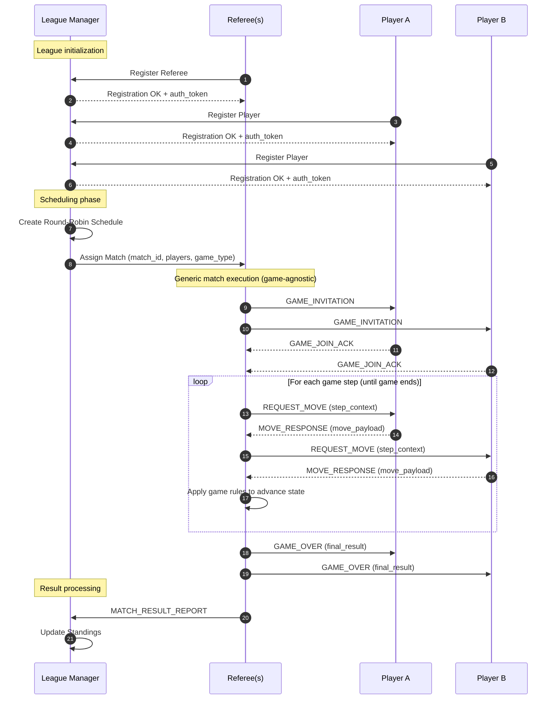

```mermaid
sequenceDiagram
    autonumber

    participant LM as League Manager
    participant R as Referee(s)
    participant P1 as Player A
    participant P2 as Player B

    Note over LM: League initialization

    R->>LM: Register Referee
    LM-->>R: Registration OK + auth_token

    P1->>LM: Register Player
    LM-->>P1: Registration OK + auth_token

    P2->>LM: Register Player
    LM-->>P2: Registration OK + auth_token

    Note over LM: Scheduling phase

    LM->>LM: Create Round-Robin Schedule
    LM->>R: Assign Match (match_id, players, game_type)

    Note over R: Generic match execution (game-agnostic)

    R->>P1: GAME_INVITATION
    R->>P2: GAME_INVITATION

    P1-->>R: GAME_JOIN_ACK
    P2-->>R: GAME_JOIN_ACK

    loop For each game step (until game ends)
        R->>P1: REQUEST_MOVE (step_context)
        P1-->>R: MOVE_RESPONSE (move_payload)

        R->>P2: REQUEST_MOVE (step_context)
        P2-->>R: MOVE_RESPONSE (move_payload)

        R->>R: Apply game rules to advance state
    end

    R->>P1: GAME_OVER (final_result)
    R->>P2: GAME_OVER (final_result)

    Note over LM: Result processing

    R->>LM: MATCH_RESULT_REPORT
    LM->>LM: Update Standings
```
