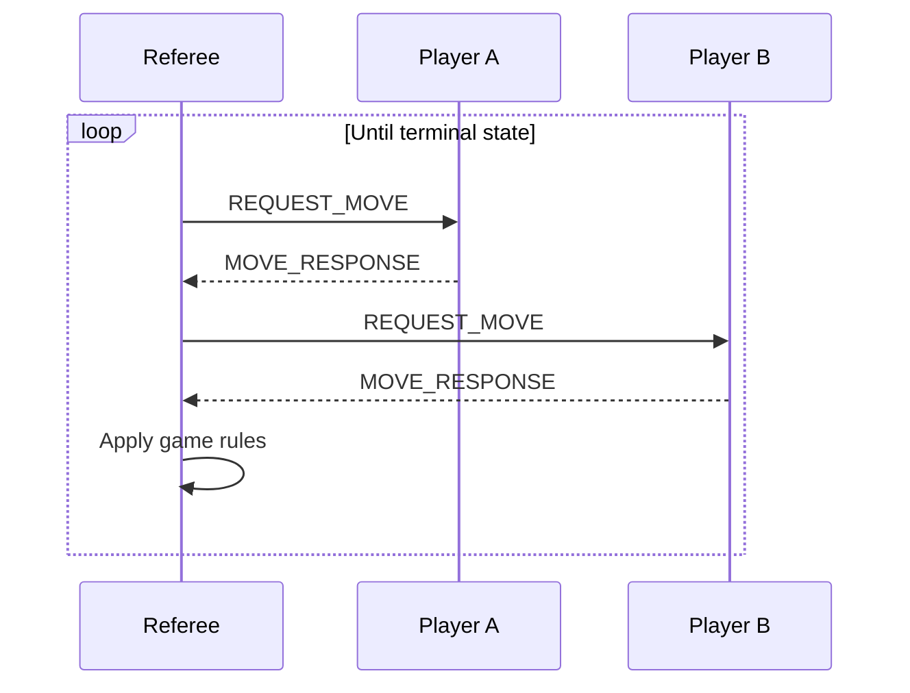

```mermaid
sequenceDiagram
    participant R as Referee
    participant P1 as Player A
    participant P2 as Player B

    loop Until terminal state
        R->>P1: REQUEST_MOVE
        P1-->>R: MOVE_RESPONSE
        R->>P2: REQUEST_MOVE
        P2-->>R: MOVE_RESPONSE
        R->>R: Apply game rules
    end
```
